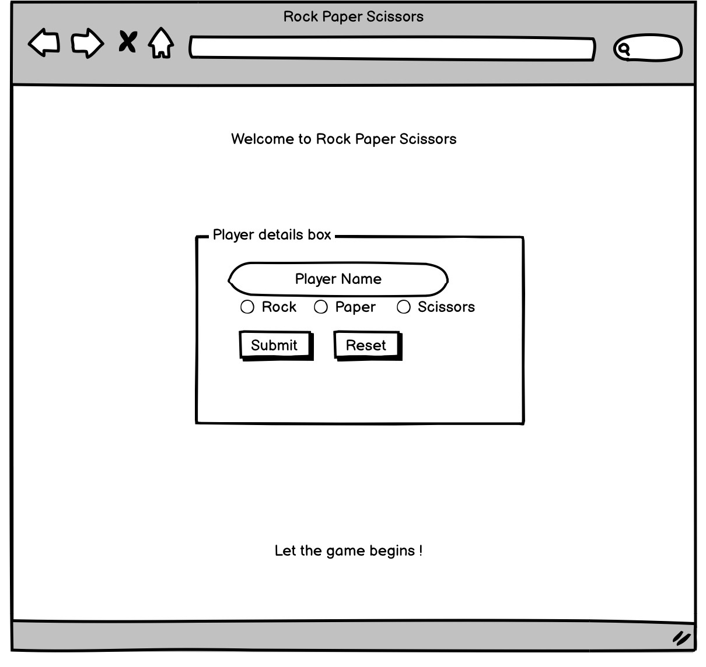

# RPS Challenge

Instructions
-------

* Feel free to use google, your notes, books, etc. but work on your own
* If you refer to the solution of another coach or trainee, please put a link to that in your README
* If you have a partial solution, **still check in a partial solution**
* You must submit a pull request to this repo with your code by 9:30am Monday morning

Task
----

The DFA team ( **DFAT** ) have asked you to provide a game for them. The daily grind is pretty tough and they need time to have a little fun.

As usual please start by

* Forking this repo
* TEST driving development of your app

Your task is to provide a _Rock, Paper, Scissors_ game for them so they can play on the web with the following user stories:

### Acceptance Criteria
```
As a DFAT member
So that I can see my name
I would like to register my name before playing an online game

As a DFAT member
So that I can enjoy myself away from the daily grind
I would like to be able to play rock/paper/scissors
```

Hints on functionality

- the DFAT member should be able to enter their name before the game
- the DFAT member will be presented the choices (rock, paper and scissors)
- the DFAT member can choose one option
- the game will choose a random option
- a winner will be declared

## Basic Rules

- Rock beats Scissors
- Scissors beats Paper
- Paper beats Rock

In code review we'll be hoping to see:

* All tests passing
* High test coverage
* The code is elegant: every class has a clear responsibility, methods are short etc.

### Extended Acceptance Criteria

#### Multiplayer

Change the game so that two DFAT members can play against each other ( _yes there are two of them_ ).

#### Rock, Paper, Scissors, Spock, Lizard

Use the _special_ rules ( _you can find them here http://en.wikipedia.org/wiki/Rock-paper-scissors-lizard-Spock_ )


## Roxana's README

For this challenge I decided to take the following steps in order to meet the user requirements

Step 1

Create a wireframe of how the game interface should look



Step 2

Create the server
Create the routes
Create the game file
Create the views

Step 3

Separe the computer class from game class

Create mock class for computer to be able to test the random choices generated
Create test to make sure server is working
Create tests to make sure the game class and computer class have working functionalities

Step 4

Work on user interface using css to make the game pages look nice


